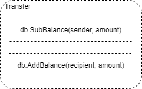

# 交易执行

## 转账

由于以太坊采用了账户余额模型，所以账户之间转账非常简单：

- 发送方账户余额 减少
- 接收方余额 增加



## 创建合约

如果发送的交易接收地址为 `0`，那么意味着创建一份合约，其中 `data` 字段为合约字节码：

```js
 eth.sendTransaction({from:"46e7328724a7...", data:"0x608060..."})
```

