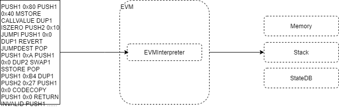

# 字节码执行过程




`EVMInterpreter` 不断从智能合约编译后的字节码中获取指令和数据，将数据或结果存放在 `Stack`  `Memory` 或 `StateDB`

```go
func (in *EVMInterpreter) Run(contract *Contract, input []byte, readOnly bool) (ret []byte, err error) {
    ...
	var (
		op          OpCode        // current opcode
		mem         = NewMemory() // bound memory
		stack       = newstack()  // local stack
		callContext = &ScopeContext{
			Memory:   mem,
			Stack:    stack,
			Contract: contract,
		}
        
		pc   = uint64(0) // program counter
        
	)
    
	// The Interpreter main run loop (contextual). This loop runs until either an
	// explicit STOP, RETURN or SELFDESTRUCT is executed, an error occurred during
	// the execution of one of the operations or until the done flag is set by the
	// parent context.
	steps := 0
	for {
		steps++
		if steps%1000 == 0 && atomic.LoadInt32(&in.evm.abort) != 0 {
			break
		}
        ...
		// Get the operation from the jump table and validate the stack to ensure there are
		// enough stack items available to perform the operation.
		op = contract.GetOp(pc)
		operation := in.cfg.JumpTable[op]
		if operation == nil {
			return nil, &ErrInvalidOpCode{opcode: op}
		}
        
		// execute the operation
		res, err = operation.execute(&pc, in, callContext)
        

		switch {
		case err != nil:
			return nil, err
		case operation.reverts:
			return res, ErrExecutionReverted
		case operation.halts:
			return res, nil
		case !operation.jumps:
			pc++
		}
	}
	return nil, nil
}
```