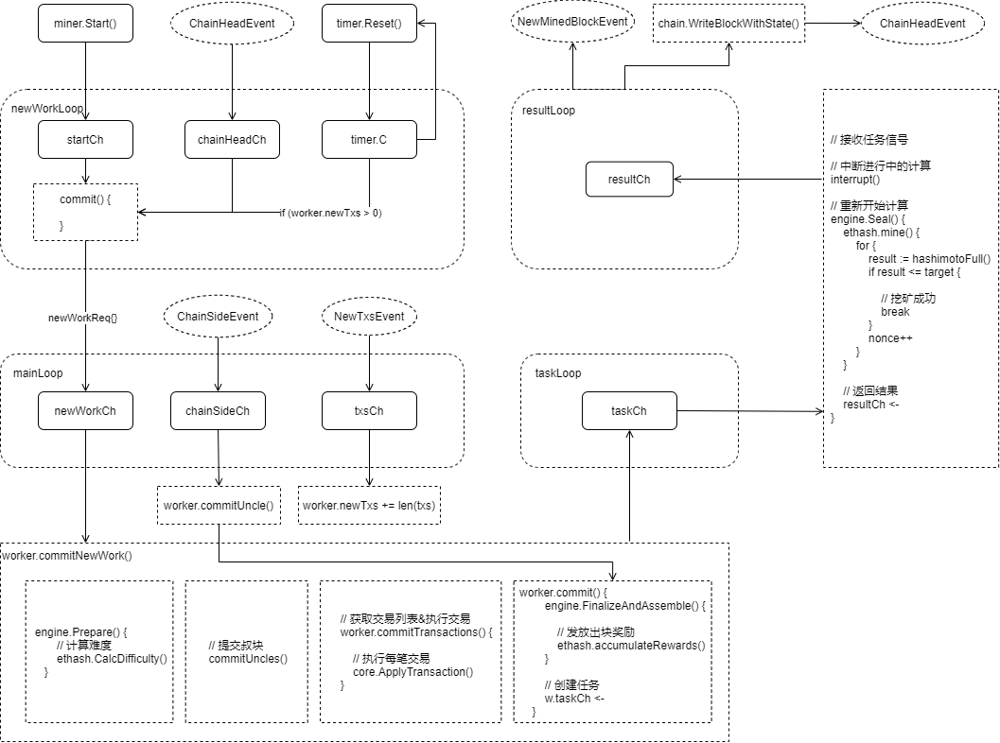

# 挖矿



## 启动挖矿

在启动 `geth` 程序的时候，可以配置挖矿相关的参数：

```

MINER OPTIONS:
  --mine                              Enable mining
  --miner.threads value               Number of CPU threads to use for mining (default: 0)
  --miner.notify value                Comma separated HTTP URL list to notify of new work packages
  --miner.notify.full                 Notify with pending block headers instead of work packages
  --miner.gasprice value              Minimum gas price for mining a transaction (default: 1000000000)
  --miner.gastarget value             Target gas floor for mined blocks (default: 8000000)
  --miner.gaslimit value              Target gas ceiling for mined blocks (default: 8000000)
  --miner.etherbase value             Public address for block mining rewards (default = first account) (default: "0")
  --miner.extradata value             Block extra data set by the miner (default = client version)
  --miner.recommit value              Time interval to recreate the block being mined (default: 3s)
  --miner.noverify                    Disable remote sealing verification

```

如果没有显式启用挖矿，即不设置参数 `--mine`，那么节点不会开始挖矿

可以在节点启动后，手动在控制台启动挖矿：

```
> miner.start(1)
```

## 信号调度

Worker 启动四个循环，通过监听各个通道的信号变化来调度挖矿过程

- newWorkLoop：
    - startCh:监听 `miner.worker.start()`
    - chainHeadCh：监听新出块事件`ChainHeadEvent`
    - timer.C：监听定时触发事件
    - 当以上任意信号发生时，调用 `commit()` 方法，提交 `newWorkReq{}` 请求

- mainLoop:
    - newWorkCh：监听 `newWorkReq{}` 信号：
        - 调用 `worker.commitNewWork()`：
            - 计算难度
            - 提交叔块
            - 执行交易
            - 创建计算任务

    - chainSideCh：监听叔块事件
    - txsCh：监听新交易事件

- taskLoop：
    - taskCh：监听任务信号：
        - 中断进行中的计算
        - 重新开始计算
        - 返回计算结果

- resultLoop：
    - resultCh：监听结果信号：
        - 广播出块事件 `NewMinedBlockEvent`
        - 写入区块链：
            - 触发 `ChainHeadEvent` 事件：
                - 由于 `newWorkLoop` 在监听`ChainHeadEvent`，所以会开始下一轮挖矿