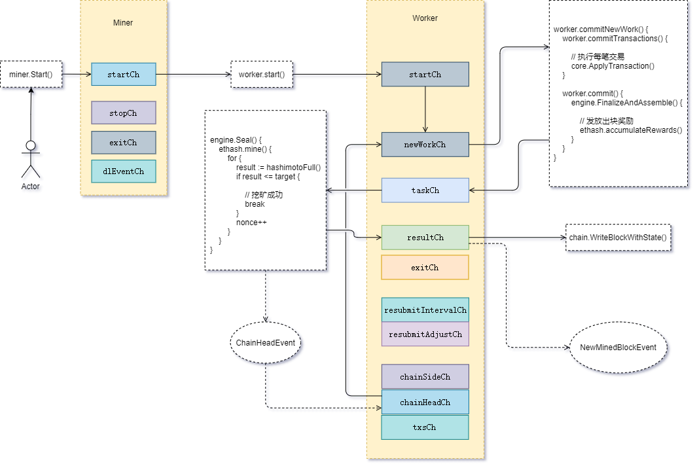

# 挖矿管理

概览 `geth` 挖矿主要流程：



## 启动挖矿

在启动 `geth` 程序的时候，可以配置挖矿相关的参数：

```

MINER OPTIONS:
  --mine                              Enable mining
  --miner.threads value               Number of CPU threads to use for mining (default: 0)
  --miner.notify value                Comma separated HTTP URL list to notify of new work packages
  --miner.notify.full                 Notify with pending block headers instead of work packages
  --miner.gasprice value              Minimum gas price for mining a transaction (default: 1000000000)
  --miner.gastarget value             Target gas floor for mined blocks (default: 8000000)
  --miner.gaslimit value              Target gas ceiling for mined blocks (default: 8000000)
  --miner.etherbase value             Public address for block mining rewards (default = first account) (default: "0")
  --miner.extradata value             Block extra data set by the miner (default = client version)
  --miner.recommit value              Time interval to recreate the block being mined (default: 3s)
  --miner.noverify                    Disable remote sealing verification

```

如果没有显式启用挖矿，即参数 `--mine`，那么节点不会开始挖矿

可以在节点启动后，手动在控制台启动挖矿：

```
> miner.start(1)
```

`miner.Start()` 方法会在 `miner.startCh` 管道发送开始信号

miner 接收到开始信号后，调用 `worker.start()`，在 `worker.startCh` 管道发送开始信号

worker 接收到开始信号后，会提交一个 `newWorkReq` 请求到 `worker.newWorkCh` 管道

 `worker.newWorkCh` 管道 接收到信号后，通过 `worker.commitNewWork()` 执行全部交易，然后提交一个出块任务信号到 `worker.taskCh` 管道


```
worker.commitNewWork() {
    worker.commitTransactions() {

        // 执行每笔交易 
        core.ApplyTransaction()
    }

    worker.commit() {
        engine.FinalizeAndAssemble() {

            // 发放出块奖励
            ethash.accumulateRewards()
        }
    }
}
```


`worker.taskCh` 管道接收到任务信号后，调用共识引擎 `engine.Seal()` 执行具体的计算任务，在 `Ethash` 共识算法中就是计算出一个满足难度要求的哈希值：

```
engine.Seal() {
    ethash.mine() {
        for {
            result := hashimotoFull()
            if result <= target {
                
                // 挖矿成功
                break 
            }
            nonce++
        }
    }
}
```

如果挖矿成功，会将结果发送到 `worker.resultCh` 管道，同时触发 `ChainHeadEvent` 事件

`worker.resultCh` 接收到结果信号后，会调用 `chain.WriteBlockWithState()` 存储新区块，同时全网广播出块事件 `NewMinedBlockEvent`

`worker.chainHeadCh` 会订阅`ChainHeadEvent` 事件，当事件发生时又发送信号到 `worker.newWorkCh`，让 worker 开启下一轮挖矿

